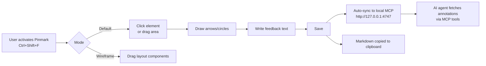

# Pinmark

<div align="center">

  

  **Visual feedback annotation tool for developers with native AI-Agent Parity & MCP Server**

  [](https://developer.chrome.com/docs/extensions/mv3/intro/)
  [](https://addons.mozilla.org/)
  [](https://www.typescriptlang.org/)
  [](LICENSE.md)
  [](https://modelcontextprotocol.io/)

  [Features](#features) · [Installation](#installation) · [Usage](#usage) · [Architecture](#architecture) · [MCP Reference](#mcp-server-reference) · [Development](#development) · [FAQ](#faq)

  Place visual markers on any webpage element, draw annotations, capture network logs console errors, and sync instantly with your AI agents via a Local MCP Server. Perfect for code reviews, bug reporting, and communicating with **Claude**, **Cursor**, **ChatGPT**, or any MCP-compatible agent.

  <video src="packages/extension/assets/pinmark.mp4" controls autoplay muted loop width="640" style="border-radius: 8px; margin-top: 16px; max-width: 100%;"></video>

</div>

---

## Table of Contents

- [What is Pinmark?](#what-is-pinmark)
- [Why Pinmark?](#why-pinmark)
- [Installation](#installation)
  - [Quick Start](#quick-start)
  - [Load Unpacked](#load-unpacked)
  - [Start MCP Server](#start-mcp-server)
- [Usage](#usage)
- [Features](#features)
  - [Visual Annotation & Editing](#visual-annotation--editing)
  - [Layout / Wireframe Mode](#layout--wireframe-mode)
  - [State & Log Capture](#state--log-capture)
  - [Keyboard Shortcuts](#keyboard-shortcuts)
  - [Local MCP Server](#local-mcp-server)
  - [GitHub Issue Creation](#github-issue-creation)
  - [Settings & Customization](#settings--customization)
- [MCP Server Reference](#mcp-server-reference)
  - [Tools](#mcp-tools)
  - [HTTP Endpoints](#http-endpoints)
  - [Server-Sent Events (SSE)](#server-sent-events-sse)
  - [Example Payloads](#example-payloads)
- [Architecture](#architecture)
  - [Monorepo Layout](#monorepo-layout)
  - [Package Reference](#package-reference)
  - [Data Flow](#data-flow)
  - [Shadow DOM Isolation](#shadow-dom-isolation)
- [Development](#development)
  - [Prerequisites](#prerequisites)
  - [Setup](#setup)
  - [Scripts](#scripts)
  - [Build](#build)
  - [TypeScript](#typescript)
  - [Testing](#testing)
  - [Linting & Formatting](#linting--formatting)
  - [CI/CD](#cicd)
  - [Release Process](#release-process)
- [Browser Support](#browser-support)
- [Troubleshooting](#troubleshooting)
- [FAQ](#faq)
- [Contributing](#contributing)
- [Roadmap](#roadmap)
- [License](#license)

---

## What is Pinmark?

**Pinmark** is a browser extension (Chrome Manifest V3, Firefox-compatible) that turns any webpage into a collaborative canvas between a human reviewer and an AI coding agent.

Instead of copy-pasting screenshots and vague descriptions like *"the button on the right looks off"*, you:

1. **Click or drag** over the exact DOM element.
2. **Draw** arrows, circles, or freehand strokes directly on the screenshot.
3. **Write** a structured comment.
4. **Copy** an AI-ready Markdown report — automatically.
5. **Sync** the annotation to a local MCP server so your AI agent can fetch, acknowledge, ask questions, or resolve it — without copy-pasting.

Pinmark closes the loop between *"I see something wrong"* and *"the agent fixed it"*.

---

## Why Pinmark?

| Pain point | Pinmark solution |
| --- | --- |
| Screenshot + vague Slack message | Numbered markers + element metadata (selector, classes, bounding rect, computed styles) |
| "Open DevTools and screenshot the console" | Automatic console error/warning capture |
| "Can you reproduce that failing fetch?" | Automatic XHR / Fetch interception at annotation time |
| Sending context across 5 chat bubbles | Single Markdown blob with screenshot, logs, DOM info, and thread |
| Agent can't act on a screenshot | MCP server exposes tools that return structured JSON the agent can reason over |
| Multi-step bug-report workflows | One keyboard shortcut toggles everything |

---

## Installation

This project is an **NPM Workspace Monorepo** with 4 buildable packages.

```bash
# 1. Clone
git clone https://github.com/Xenonesis/Pinmark.git
cd Pinmark

# 2. Install dependencies at root
npm install

# 3. Build all packages (@pinmark/core, @pinmark/pinmark, @pinmark/extension)
npm run build
```

### Load Unpacked

| Browser | Steps |
|---------|-------|
| **Chrome / Edge** | `chrome://extensions` → Developer mode → Load unpacked → select `packages/extension/dist/` |
| **Firefox** | `about:debugging` → This Firefox → Load Temporary Add-on → select `packages/extension/dist/manifest.json` |

> **Tip:** After loading, pin the Pinmark icon to your toolbar for 1-click access.

### Start MCP Server

```bash
# From repo root
npm run start -w @pinmark/mcp

# Or directly
node packages/mcp/dist/cli.js server --port 4747
```

Add the server to your AI client:

| Client | How to connect |
|--------|----------------|
| **Cursor** | Settings → MCP → Add → `http://127.0.0.1:4747` |
| **Claude Desktop** | Edit `claude_desktop_config.json` → add HTTP transport pointing to `127.0.0.1:4747` |
| **Custom agents** | Use the HTTP or SSE endpoints directly |

---

## Usage



1. **Activate** — Hit `Ctrl+Shift+F` (`Cmd+Shift+F` on Mac) or click the extension icon.
2. **Select & draw** — Click an element or drag a box. Use the image editor for arrows, circles, or freehand.
3. **Write feedback** — Type your instruction (e.g. `"Make this button indigo-600"`).
4. **Save & sync** — The feedback is POSTed to the MCP server and copied to your clipboard as Markdown.

---

## Features

### Visual Annotation & Editing

- **Area Drag Selection** — Draw boxes to select and markup entire UI sections, not just single elements.
- **Text Selection** — Select any page text to annotate typos, content issues, or copy changes; quoted text is included in output.
- **Image Editor** — Built-in drawing tools (arrows, circles, freehand) rendered directly over a screenshot of the selected area.
- **Persistent markers** — Markers stay visible and positioned until explicitly cleared or the page reloads.
- **Element capture** — Records tag name, classes, IDs, data attributes, text content, bounding rect, computed styles, component hierarchy (React / Angular / Vue / Svelte via runtime detection), and accessibility hints.

### Layout / Wireframe Mode

Press `L` to open the layout panel.

- **65+ Component palette** — Drag-and-drop building blocks (navbar, hero, card, form, modal, table, footer, etc.) onto any page.
- **Rearrange sections** — Grab existing page elements and reposition them to sketch new layouts.
- **Purpose field** — Attach intent / context strings to every placement.
- **Wireframe overlay** — Fade the current page to a configurable opacity and sketch a new layout from scratch.
- **Agent-readable output** — Annotations in layout mode include `kind: "placement"` or `kind: "rearrange"` for structured agent consumption.

### State & Log Capture

When you annotate, Pinmark snapshots the surrounding developer context:

- **Network interception** — Captures XHR and Fetch requests that fired during the annotation window.
- **Console capture** — Grabs `console.error` and `console.warn` entries from the browser console.
- **State snapshot** — Optional capture of `localStorage`, `sessionStorage`, and cookies.
- **Session recording** — Uses `rrweb` to record DOM mutations and replay them if needed.

### Keyboard Shortcuts

| Shortcut | Action |
|----------|--------|
| `Ctrl+Shift+F` / `Cmd+Shift+F` | Toggle feedback mode |
| `L` | Toggle layout / wireframe mode |
| `P` | Pause or resume CSS animations |
| `H` | Hide or show existing markers |
| `C` | Copy feedback as Markdown |
| `X` | Clear all annotations |
| `F` | Freeze animations |
| `Esc` | Close / cancel current action |

> **Note:** Shortcuts are context-aware. Typing in a text field inside the layout panel will not trigger `clearAll()` or other global shortcuts.

### Local MCP Server

Pinmark ships a local HTTP + SSE server that exposes your annotations to any MCP-compatible AI agent.

- **Auto-sync** — Every annotation is automatically POSTed to `http://127.0.0.1:4747` as soon as you save.
- **Cursor / Claude integration** — Agents can fetch your exact screenshots, drawings, console errors, and network traces without you copy-pasting anything.
- **Two-way communication** — Agents can:
  - `acknowledge` an annotation
  - `ask_question` to start a thread
  - `resolve` with a summary
  - `dismiss` with a reason
- **Threading** — Annotations support multi-turn conversations between human and agent via `pinmark_reply` and `pinmark_ask_question`.

### GitHub Issue Creation

One-click export from the extension popup:

- Screenshot with annotations
- Captured console logs
- Network request summary
- Structured Markdown body
- Title / label helpers

### Settings & Customization

| Setting | Options |
|---------|---------|
| **Output detail** | Compact · Standard · Detailed · Forensic |
| **Marker color** | Color picker or preset swatches |
| **Hide until restart** | Start with all markers hidden after browser restart |
| **Block interactions** | Prevent page clicks while annotating |
| **Theme** | Light · Dark · Auto (match system) |

---

## MCP Server Reference

The Pinmark MCP server exposes tools that AI agents can call to read, reply to, and resolve your visual annotations.

### MCP Tools

| Tool | Description |
|------|-------------|
| `pinmark_list_annotations` | Returns all pending annotations for the current URL. |
| `pinmark_get_annotation` | Fetches a single annotation by ID with full metadata and embedded screenshot. |
| `pinmark_reply` | Adds a reply to an annotation thread (`author: "agent"` | `"human"`). |
| `pinmark_ask_question` | Creates a threaded question on an annotation. |
| `pinmark_acknowledge` | Marks an annotation as `acknowledged`. |
| `pinmark_resolve` | Marks an annotation as `resolved` with an optional summary. |
| `pinmark_dismiss` | Marks an annotation as `dismissed` with a reason. |
| `pinmark_clear` | Clears all annotations for the current URL. |

### HTTP Endpoints

The MCP server also exposes a raw HTTP API on the same port for non-MCP consumers or debugging.

| Method | Endpoint | Body | Description |
|--------|----------|------|-------------|
| `GET` | `/annotations` | — | List annotations for current session/URL |
| `GET` | `/annotations/:id` | — | Fetch single annotation |
| `POST` | `/annotations` | `PinmarkAnnotation` JSON | Create annotation (used by extension) |
| `POST` | `/annotations/:id/reply` | `{ author, message }` | Add thread reply |
| `POST` | `/annotations/:id/resolve` | `{ summary? }` | Resolve annotation |
| `POST` | `/annotations/:id/dismiss` | `{ reason }` | Dismiss annotation |
| `DELETE` | `/annotations/:id` | — | Delete annotation |
| `GET` | `/health` | — | Liveness check |

### Server-Sent Events (SSE)

- `GET /events` keeps an open connection streaming annotation updates in real time.

---

## Architecture

### Monorepo Layout

```
Pinmark/
├── packages/
│   ├── core/           # @pinmark/core   — Zod schemas, shared types, validation
│   ├── pinmark/        # @pinmark/pinmark — Overlay, toolbar, image editor, storage adapter
│   │   ├── vanilla/    # Framework-agnostic Web Component base
│   │   └── react/      # React bindings (optional peer dep)
│   ├── extension/      # @pinmark/extension — Chrome/Firefox extension wrapper
│   │   ├── src/
│   │   │   ├── background/   # Service worker
│   │   │   ├── content/      # Content script (ISOLATED world)
│   │   │   ├── popup/        # Extension popup UI
│   │   │   └── shared/       # Shared styles / messages
│   │   └── manifest.json     # Manifest V3 (+ Gecko config for Firefox)
│   ├── mcp/            # @pinmark/mcp — MCP stdio server + HTTP/SSE bridge
│   │   ├── cli.ts
│   │   ├── server.ts
│   │   ├── http-routes.ts
│   │   ├── mcp-tools.ts
│   │   └── store.ts
│   └── server/         # @pinmark/server — Reserved for future cloud backend
├── scripts/
│   ├── build-firefox.mjs
│   └── generate-icons.js
├── index.html          # Marketing landing page (GitHub Pages)
├── package.json        # Root workspace config
└── PLAN.md             # Bug audit & implementation roadmap
```

### Package Reference

#### `@pinmark/core`

Single source of truth for every annotation that flows through the system.

- Zod schemas for `ElementInfo`, `PinmarkAnnotation`, `ThreadReply`, `Session`.
- Framework-agnostic; zero browser APIs at this layer.
- Used by extension, pinmark UI, and MCP server.

#### `@pinmark/pinmark`

Framework-agnostic visual layer.

- **Overlay** — Shadow-DOM host that renders markers, the drawing canvas, and the feedback modal.
- **Launcher** — Handles activation / deactivation.
- **FeedbackManager` — CRUD over annotations with `StorageAdapter` plug-in point.
- **Image editor** — Canvas-based arrows, circles, freehand.
- Exports a React wrapper in `dist/react/` for teams that want React integration.

#### `@pinmark/extension`

Browser-specific integration layer.

- **Content script** (`src/content/index.ts`) — Bootstraps the overlay in the page's isolated world.
- **Main-world script** (`src/content/main-world.ts`) — Bridges isolated-world events to the page context when needed.
- **Background** — Service worker for extension lifecycle, storage events, and context menus.
- **Popup** (`src/popup/`) — Quick status, theme toggle, GitHub issue export, and server connectivity check.
- **Manifest** — Targets both Chromium (`manifest_version: 3`) and Firefox (`browser_specific_settings.gecko`).

Build powered by **Vite** + **@crxjs/vite-plugin` for HMR during development.

#### `@pinmark/mcp`

Local bridge between the extension and AI agents.

- **CLI** (`cli.ts`) — `pinmark-mcp server --port 4747`
- **HTTP server** (`server.ts`) — Express + CORS, SSE for live updates.
- **MCP tools** (`mcp-tools.ts`) — Type-safe tool implementations wired to the in-memory store.
- **Store** (`store.ts`) — Threaded annotation store with reply support.
- Uses `@modelcontextprotocol/sdk` for stdio transport and tool discovery.

#### `@pinmark/server`

Currently a placeholder for a future cloud backend (remote sync, multi-user sessions, webhook delivery).

### Data Flow

```
User interaction
    │
    ▼
@pinmark/pinmark (Overlay + Launcher)
    │
    ├─ captures screenshot via html2canvas
    ├─ extracts DOM metadata
    ├─ records rrweb session delta
    └─ intercepts network + console events
    │
    ▼
FeedbackManager → StorageAdapter (chrome.storage.local)
    │
    ├─► clipboard (Markdown)
    ├─► popup (GitHub issue)
    └─► HTTP POST → @pinmark/mcp (port 4747)
             │
             ├─► in-memory store
             ├─► SSE subscribers
             └─► MCP stdio (agent tools)
```

### Shadow DOM Isolation

The overlay is mounted in a **Shadow Root** so that page styles cannot leak into the annotation UI, and vice versa.

- All marker elements, the drawing canvas, and the feedback modal live inside the shadow boundary.
- Exceptions: the rearrange "ghost" element was historically appended to `document.body` and has been flagged for migration into the shadow root.

---

## Development

### Prerequisites

| Tool | Minimum version |
|------|-----------------|
| Node.js | 18.x or 20.x |
| npm | 9.x |
| Chrome / Chromium | 115+ (for MV3 content scripts) |
| Firefox | 128+ (for temporary add-on loading) |

### Setup

```bash
# Install everything
npm install

# Build TypeScript across all packages
npm run build
```

### Scripts

| Script | Package | What it does |
|--------|---------|--------------|
| `npm run dev` | `@pinmark/extension` | Starts Vite dev server with HMR |
| `npm run build` | all | Type-check + bundle to `dist/` |
| `npm run build:firefox` | `@pinmark/extension` | Build then rewrite manifest for Firefox |
| `npm run generate-icons` | root | Regenerate icon sets from source SVG |
| `npm run start -w @pinmark/mcp` | `@pinmark/mcp` | Launch local MCP server on port 4747 |

### Build

```bash
# All packages
npm run build

# Single package
npm run build -w @pinmark/core
npm run build -w @pinmark/pinmark
npm run build -w @pinmark/extension
npm run build -w @pinmark/mcp
```

### TypeScript

Strict mode enabled across all packages. `tsconfig.base.json` defines shared compiler options:

- `strict: true`
- `target: ES2022`
- `module: ESNext` + `moduleResolution: bundler`
- `declaration: true`
- `sourceMap: true`

### Testing

No formal test runner is configured yet. For now, the repo relies on:

- Type-checking via `tsc` in every `build` step.
- Manual smoke tests documented in `PLAN.md` Verification section.
- Ponytailled runtime checks via the internal bug audit.

If you add tests, keep them minimal:

```bash
# Suggested (not yet in repo)
npm install -D vitest
```

Run against `packages/core/src/schema.ts` first — schemas are the easiest unit-test surface.

### Linting & Formatting

Not configured out of the box. Recommended baseline:

- **ESLint** with `@typescript-eslint/recommended`
- **Prettier** for formatting (2-space indent, single quotes matching existing code)

---

## Browser Support

| Browser | Status | Notes |
|---------|--------|-------|
| Chrome 115+ | ✅ Stable | Primary target |
| Edge 115+ | ✅ Stable | Uses Chromium engine |
| Firefox 128+ | ⚠️ Preview | Requires `build:firefox`; manifest v2 fallback not maintained |
| Safari | ❌ Not supported | No WebExtension polyfill in current codebase |

---

## Troubleshooting

**Extension doesn't appear in `chrome://extensions` after Load Unpacked**
- Verify you selected `packages/extension/dist/`, not the repo root.
- Run `npm run build` first if the `dist/` folder is missing.
- Check the browser console for manifest parsing errors.

**MCP server is unreachable**
- Confirm port `4747` is not already in use: `lsof -i :4747` or `netstat -ano | findstr 4747`.
- Restart the server after extension reloads; the extension caches the URL on install.
- CORS is enabled on all origins for localhost; proxies or VPNs may interfere.

**Markers disappear after SPA navigation**
- This is a known issue tracked in internal bug audit; `hideUntilRestart` is not currently reapplied after internal overlay recreation.
- Workaround: toggle Pinmark off and back on (`Ctrl+Shift+F` twice).

**Pressing `x` inside a layout text field clears all annotations**
- Same internal bug audit; single-letter shortcuts are not currently blocked when focus is inside shadow-root inputs.
- Workaround: click outside the layout panel before pressing shortcut keys.

**GitHub issue creation fails**
- The extension uses popup-based OAuth; make sure you are logged into GitHub in the same browser profile.
- Anonymous / private modes may block the auth redirect.

---

## FAQ

**Is Pinmark free?**
Source-available and free for non-commercial personal use under the Polyform Noncommercial 1.0.0 license. A separate commercial license is available from the copyright holder.

**Does it work on localhost?**
Yes. The extension matches `<all_urls>`, which includes `http://localhost:*` and `http://127.0.0.1:*`.

**Can I use this in React / Vue / Angular apps?**
Yes. The overlay is framework-agnostic. `@pinmark/pinmark` has optional React peer-dependencies if you want React bindings; Vue / Angular / Svelte detection is handled inside the core schema for metadata purposes.

**Does it break page styles?**
No. The UI runs inside a Shadow DOM. However, the screenshot captured by `html2canvas` is a raster image, so it is naturally isolated from page CSS.

**Can the MCP server run on a different machine?**
Not out of the box — the extension auto-POSTs to `127.0.0.1`. You can patch the endpoint URL in the extension source or run a tunnel (e.g. `ngrok`) to forward port 4747.

**Is there a way to export annotations as JSON instead of Markdown?**
Yes. The MCP HTTP API returns structured JSON. You can also extend `FeedbackManager` with a custom `StorageAdapter` that writes to a file or database.

---

## Deep Technical Reference

This appendix expands internal mechanics for developers who want to modify, embed, or extend Pinmark.

### Core Schema Reference

`ElementInfo` fields:
- `selector`: CSS selector for the annotated element.
- `tagName`: uppercase HTML tag, e.g. `DIV`, `BUTTON`.
- `id`: DOM id attribute when present.
- `classes`: tokenized class list.
- `textContent`: non-empty text when available.
- `dataAttributes`: parsed `data-*` attributes.
- `component`: runtime framework detection result.
- `boundingRect`: `DOMRect` fields: x, y, width, height, top, right, bottom, left.
- `computedStyles`: `getComputedStyle` snapshot at annotation time.
- `accessibility`: ARIA properties, role, labeledBy, best-effort.
- `selectionText`: text selected by user before clicking annotate.
- `screenshot`: Data-URL from `html2canvas`.

`PinmarkAnnotation` fields:
- `id`: UUID-like identifier.
- `index`: order number in the UI.
- `comment`: user-entered instruction.
- `url`: full page URL at capture time.
- `timestamp`: Unix ms.
- `element`: `ElementInfo`.
- `consoleLogs`: console entries captured during the annotation window.
- `networkRequests`: XHR / Fetch requests captured during the annotation window.
- `sessionRecording`: rrweb events up to the annotation moment.
- `areaRect`: drag selection bounding rect when using area mode.
- `state`: optional storage snapshot for localStorage, sessionStorage, and cookies.
- `category`: `bug | improvement | question | design`.
- `intent`: `fix | change | question | approve`.
- `severity`: `blocking | important | suggestion`.
- `kind`: `feedback | placement | rearrange`.
- `markerType`: `single | multi | area`.
- `status`: `pending | acknowledged | resolved | dismissed`.
- `resolvedBy`: agent identifier.
- `resolvedAt`: Unix ms.
- `dismissReason`: free-text.
- `replies`: threaded replies.

`Session` fields:
- `id`: session identifier.
- `url`: page URL.
- `createdAt`: Unix ms.
- `updatedAt`: Unix ms.
- `annotations`: ordered `PinmarkAnnotation[]`.

### MCP JSON Examples

List sessions:
```json
[]
```

Create session:
```json
{ "url": "https://example.com/dashboard" }
```

Create annotation:
```json
{
  "id": "ann_abc123",
  "index": 1,
  "comment": "Increase contrast here",
  "url": "https://example.com/dashboard",
  "timestamp": 1718421513000,
  "element": {
    "selector": "#signup-btn",
    "tagName": "BUTTON",
    "classes": ["btn", "btn-primary"],
    "textContent": "Sign up",
    "boundingRect": {
      "x": 120, "y": 340, "width": 192, "height": 48,
      "top": 340, "right": 312, "bottom": 388, "left": 120
    },
    "dataAttributes": {}
  },
  "markerType": "single"
}
```

Reply to annotation:
```json
{ "agent": "Claude", "message": "Using indigo-600 as requested." }
```

Update status:
```json
{ "status": "resolved", "agent": "Claude" }
```

### Storage Key Derivation

Annotations are stored per origin plus pathname:
- `https://example.com/dashboard` -> `pinmark_feedback_https://example.com/dashboard`

Query strings and hashes are not separated into distinct keys.

### MCP Session Creation

The extension derives a session id from the current URL:
```ts
const sessionId = 'session_' + btoa(message.url)
  .replace(/[^a-z0-9]/gi, '')
  .substring(0, 10);
```

### Content Script Lifecycle

On startup, the content script asks background for tab state and only initializes the overlay if active. On URL change, the overlay is deactivated and recreated with feedback loaded from `chrome.storage.local`. This avoids mutating live config inside the existing instance.

### Message Types

The extension communicates via a typed union:
- `TOGGLE_EXTENSION`
- `GET_STATE` / `SET_STATE`
- `GET_SETTINGS` / `SAVE_SETTINGS`
- `GET_FEEDBACK` / `SAVE_FEEDBACK`
- `ACTIVATE_OVERLAY` / `DEACTIVATE_OVERLAY`
- `ADD_FEEDBACK` / `REMOVE_FEEDBACK` / `UPDATE_FEEDBACK`
- `COPY_FEEDBACK` / `COPY_JSON`
- `CLEAR_FEEDBACK`
- `TOGGLE_MARKERS` / `TOGGLE_PAUSE`
- `CREATE_GITHUB_ISSUE`
- `UPDATE_SETTINGS`

### Build Outputs

| Package output | Path |
|----------------|------|
| Chromium bundle | `packages/extension/dist/` |
| Firefox bundle | `packages/extension/dist-firefox/` |
| Core types | `packages/core/dist/` |
| Pinmark UI | `packages/pinmark/dist/` |
| MCP server | `packages/mcp/dist/` |

### Firefox Build Notes

`npm run build:firefox` rewrites the manifest and asset paths for Gecko. Temporary add-ons in Firefox must be loaded from a directory containing `manifest.json`, not a zip.

### GitHub Issue Integration

Requires `githubToken` and `githubRepo` in settings. The service worker sends the Markdown body directly to GitHub and returns `html_url` on success.

### Contributing

1. Fork and clone.
2. Create a feature branch: `git checkout -b feat/my-feature`.
3. Make your change, keeping diffs minimal and focused.
4. Run `npm run build` and verify Chrome + MCP paths.
5. Open a PR with a clear description of the problem and solution.

All contributions are licensed under the same **Polyform Noncommercial 1.0.0** terms as the rest of the repository.

---

## Roadmap

- [ ] Cloud sync / multi-device session sharing (`@pinmark/server`)
- [ ] User accounts and annotation history
- [ ] Chrome Web Store publication
- [ ] `pinmark_apply_fix` MCP tool (agent-driven DOM patches)
- [ ] Firefox stable release with signed add-on
- [ ] Custom screenshot compression and upload presets
- [ ] Plugin system for third-party exporters (Linear, Jira, Notion)


---

# Appendix: Deep Technical Reference

This section expands on internal mechanics for developers who want to modify, embed, or extend Pinmark.

## Appendix A: Core Schema Reference

### ElementInfo fields

```text
selector        String    CSS selector for the annotated element
tagName         String    Uppercase HTML tag, e.g. DIV, BUTTON
id              String?   DOM id attribute (empty string -> undefined)
classes         []String  Tokenized class list
textContent     String?   Non-empty textContent if present
dataAttributes  {}        Parsed data-* attributes, e.g. { "test-id": "hero-btn" }
component       Object?   Runtime framework detection result
  framework     String    react | angular | vue | svelte | unknown
  name          String    Component/class name if detectable
  props         {}?       Reactive props snapshot (framework-dependent)
  filePath      String?   Source file path (devtools hints, best-effort)
  lineNumber    Number?   Source line number (best-effort)
  hierarchy     []String  Render-path breadcrumbs
boundingRect    Object    DOMRect fields: x, y, width, height, top, right, bottom, left
computedStyles  {}?       getComputedStyle snapshot at annotation time
accessibility   {}?       ARIA props, role, labeledBy (best-effort)
selectionText   String?   Text selected by user before clicking annotate
screenshot      String?   Data-URL (PNG/JPEG) from html2canvas
```

### PinmarkAnnotation fields

```text
id              String    UUID-like identifier
index           Number    Order number in the UI
comment         String    User-entered instruction
url             String    Full page URL at capture time
timestamp       Number    Unix ms
element         Object    ElementInfoSchema (see above)
consoleLogs     []?       Console entries captured during annotation window
networkRequests []?       XHR / Fetch requests captured during annotation window
sessionRecording[]?      rrweb events up to the annotation moment
areaRect        Object?   Bounding rect of drag selection (x, y, w, h)
state           Object?   Storage snapshot
  localStorage  {}?
  sessionStorage{}?
  cookies       String?
category        String?   bug | improvement | question | design
intent          String?   fix | change | question | approve
severity        String?   blocking | important | suggestion
kind            String?   feedback | placement | rearrange
markerType      String?   single | multi | area
status          String?   pending | acknowledged | resolved | dismissed
resolvedBy      String?   MCP agent identifier
resolvedAt      Number?   Unix ms
dismissReason   String?   Free-text
replies         []?       ThreadReply array
  id            String
  author        String    human | agent
  message       String    Thread text
  timestamp     Number    Unix ms
```

### Session fields

```text
id        String    Session identifier
url       String    Page URL
createdAt Number    Unix ms
updatedAt Number    Unix ms (mutated on annotate, reply, status change)
annotations []     PinmarkAnnotation[]
```

## Appendix B: MCP Tool Schemas (Full JSON)

### pinmark_list_annotations

Request:
```json
{}
```

Response:
```json
[
  {
    "id": "session_a1b2c3",
    "url": "https://example.com/dashboard",
    "annotationCount": 3,
    "updatedAt": "2026-06-15T04:18:32.000Z"
  }
]
```

### pinmark_get_annotation

Request:
```json
{ "annotationId": "ann_7f3d99" }
```

Response:
```json
{
  "id": "ann_7f3d99",
  "index": 1,
  "comment": "Increase contrast here",
  "url": "https://example.com/dashboard",
  "timestamp": 1718421513000,
  "element": { /* full ElementInfo */ }
}
```

### pinmark_reply

Request:
```json
{ "annotationId": "ann_7f3d99", "author": "agent", "message": "Switched to indigo-600." }
```

Response:
```json
{ "success": true }
```

### pinmark_ask_question

Request:
```json
{ "annotationId": "ann_7f3d99", "question": "Should this use the new design tokens?", "agentName": "Claude Code" }
```

Response:
```json
{ "success": true, "message": "Question added to annotation ann_7f3d99." }
```

### pinmark_acknowledge

Request:
```json
{ "annotationId": "ann_7f3d99" }
```

Response:
```json
{ "success": true, "message": "Annotation ann_7f3d99 marked as acknowledged." }
```

### pinmark_resolve

Request:
```json
{ "annotationId": "ann_7f3d99", "agentName": "Claude Code" }
```

Response:
```json
{ "success": true, "message": "Annotation ann_7f3d99 marked as resolved by Claude Code." }
```

### pinmark_dismiss

Request:
```json
{ "annotationId": "ann_7f3d99", "reason": "Out of scope for current sprint." }
```

Response:
```json
{ "success": true, "message": "Annotation ann_7f3d99 dismissed." }
```

## Appendix C: HTTP API Examples

### Create a session

```bash
curl -X POST http://127.0.0.1:4747/sessions \
  -H 'Content-Type: application/json' \
  -d '{"url": "https://example.com/dashboard"}'
```

Response:
```json
{ "id": "session_x9k2m4", "url": "https://example.com/dashboard", "createdAt": 1718421512000, "updatedAt": 1718421512000, "annotations": [] }
```

### Create an annotation

```bash
curl -X POST http://127.0.0.1:4747/sessions/session_x9k2m4/annotations \
  -H 'Content-Type: application/json' \
  -d '{
    "id": "ann_abc123",
    "index": 1,
    "comment": "Increase contrast here",
    "url": "https://example.com/dashboard",
    "timestamp": 1718421513000,
    "element": {
      "selector": "#signup-btn",
      "tagName": "BUTTON",
      "classes": ["btn", "btn-primary"],
      "textContent": "Sign up",
      "boundingRect": {
        "x": 120, "y": 340, "width": 192, "height": 48,
        "top": 340, "right": 312, "bottom": 388, "left": 120
      },
      "dataAttributes": {}
    },
    "markerType": "single"
  }'
```

### Add a reply

```bash
curl -X POST http://127.0.0.1:4747/annotations/ann_abc123/reply \
  -H 'Content-Type: application/json' \
  -d '{"agent": "Claude", "message": "Using indigo-600 as requested."}'
```

### Resolve an annotation

```bash
curl -X PATCH http://127.0.0.1:4747/annotations/ann_abc123/status \
  -H 'Content-Type: application/json' \
  -d '{"status": "resolved", "agent": "Claude"}'
```

### SSE stream

```bash
curl -N http://127.0.0.1:4747/events
```

Output:
```
event: annotation_update
data: {"id":"ann_abc123","status":"resolved","resolvedBy":"Claude","resolvedAt":1718421555000}
```

## Appendix D: Storage Adapter Interface

To plug in a custom persistence layer (IndexedDB, SQLite, Gist, linear webhooks), implement:

```ts
export interface StorageAdapter {
  getSettings(): Promise<PinmarkSettings>;
  saveSettings(settings: Partial<PinmarkSettings>): Promise<void>;
  getFeedback(url: string): Promise<PinmarkAnnotation[]>;
  saveFeedback(url: string, feedback: PinmarkAnnotation[]): Promise<void>;
  clearFeedback(url: string): Promise<void>;
}
```

**Default implementation:** `chrome.storage.local` via `ChromeStorageAdapter`.

Key derivation (`packages/extension/src/shared/storage.ts`):
```ts
export function getStorageKeyForUrl(url: string): string {
  try {
    const urlObj = new URL(url);
    return `pinmark_feedback_${urlObj.origin}${urlObj.pathname}`;
  } catch {
    return `pinmark_feedback_${url}`;
  }
}
```

This means:
- `https://example.com/dashboard` -> `pinmark_feedback_https://example.com/dashboard`
- Hash routes are grouped at the pathname level, not query/hash.

## Appendix E: Content Script Lifecycle

From `packages/extension/src/content/index.ts`:

```ts
async function startupInit() {
  const response = await sendMessage({ type: 'GET_STATE' });
  const isActive = response?.isActive ?? false;
  if (isActive) {
    initializeLauncher();
    await initializeOverlay();
  }
}

function initializeOverlay() {
  overlay = new Overlay(settings, config, feedback);
  feedbackManager = overlay.getFeedbackManager();
  overlay.activate();
  if (settings.hideUntilRestart) overlay.toggleMarkers();
}
```

**SPA navigation detection:**
- `setInterval` every 1000ms compares `window.location.href` against `lastCheckedUrl`.
- `popstate` and `hashchange` listeners also trigger `handleUrlChange()`.
- On URL change: `overlay.deactivate()`, create a **new** `Overlay` with fresh feedback, `activate()`.
- This is not a clean hotswap; it is safer to recreate than mutate config in place.

**Message routing** (`chrome.runtime.onMessage.addListener`):
- `TOGGLE_EXTENSION` -> initialize or deactivate.
- `ACTIVATE_OVERLAY` / `DEACTIVATE_OVERLAY` -> explicit lifecycle control.
- `TOGGLE_MARKERS` -> `overlay.toggleMarkers()`.
- `TOGGLE_PAUSE` -> `overlay.togglePause()`.
- `CLEAR_FEEDBACK` -> `feedbackManager.clearAll()` + `overlay.clearAllMarkers()`.
- `COPY_FEEDBACK` -> `feedbackManager.toMarkdown()` -> `navigator.clipboard.writeText`.
- `COPY_JSON` -> `overlay.copyJson()`.
- `ADD_FEEDBACK` / `REMOVE_FEEDBACK` / `UPDATE_FEEDBACK` -> mutate `FeedbackManager` then refresh markers.
- `UPDATE_SETTINGS` -> `overlay.updateSettings()`.

## Appendix F: Background Service Worker Flow

From `packages/extension/src/background/index.ts`:

**MCP sync:**
```ts
const sessionId = 'session_' + btoa(message.url)
  .replace(/[^a-z0-9]/gi, '')
  .substring(0, 10);

await fetch(`${mcpEndpoint}/sessions`, {
  method: 'POST',
  headers: { 'Content-Type': 'application/json' },
  body: JSON.stringify({ url: message.url, sessionId })
});

await fetch(`${mcpEndpoint}/sessions/${sessionId}/annotations`, {
  method: 'POST',
  headers: { 'Content-Type': 'application/json' },
  body: JSON.stringify(message.item)
});
```

**GitHub issue creation:**
```ts
await fetch(`https://api.github.com/repos/${settings.githubRepo}/issues`, {
  method: 'POST',
  headers: {
    'Authorization': `token ${settings.githubToken}`,
    'Accept': 'application/vnd.github.v3+json',
    'Content-Type': 'application/json'
  },
  body: JSON.stringify({
    title: `Pinmark Feedback: ${new URL(message.url).pathname}`,
    body: message.content
  })
});
```

**Tab state:** A `Map<number, TabState>` keeps `isActive`, `isPaused`, `markersVisible` per tab. State is cleared on `chrome.tabs.onRemoved`.

## Appendix G: Known Issues

| Issue | Location | Root cause | Workaround | Fix path |
|-------|----------|------------|------------|----------|
| Markers disappear after SPA navigation | `background/index.ts` + `content/index.ts` | `handleUrlChange` destroys/recreates `Overlay` but `hideUntilRestart` toggle is not reapplied on the new instance | Toggle extension off/on | Re-apply `overlay.toggleMarkers()` after `overlay.activate()` in `handleUrlChange` |
| Single-letter shortcuts fire inside layout inputs | `content/index.ts` | Shadow-root inputs do not stop propagation to global keydown listener | Click outside layout before pressing shortcuts | Add `e.stopPropagation()` on layout input keydown |
| Rearrange ghost appended to `document.body` | Overlay architecture | Not migrated to shadow root | None | Move ghost element into shadow root |
| MCP session ID collision risk | `background/index.ts` | `btoa(url)` truncation + alphanumeric filter can collide on similar URLs | None | Use a shorter deterministic hash or full base64 |
| No persistence on MCP server restart | `store.ts` | Store is `Map` in process memory only | None until restart | Add SQLite / JSON file persistence |
| Service worker fetch uses no credentials / auth | `background/index.ts` | Not implemented | None | Add `credentials: 'include'` or bearer token if needed |
| GitHub token stored in plain text | `shared/storage.ts` + `shared/types.ts` | `chrome.storage.local` is not encrypted | OS-level disk encryption | Move token to Chrome Identity API OAuth flow |
| `hideUntilRestart` state not restored if content script reloads before settings read | `content/index.ts` | `startupInit` -> `initializeOverlay` reads settings asynchronously; brief flash possible | None | Pre-fetch settings before overlay creation |
| `navigator.clipboard` may fail in non-secure contexts | `content/index.ts` | Clipboard API requires HTTPS or localhost | Use fallback `document.execCommand('copy')` | Add fallback path in `COPY_FEEDBACK` handler |

## Appendix H: Security & Privacy

### Extension permissions

| Permission | Why |
|------------|----|
| `activeTab` | Access DOM on the current tab when user toggles Pinmark |
| `storage` | Persist annotations and settings in `chrome.storage.local` |
| `scripting` | Inject content and main-world scripts |
| `sidePanel` (Chrome) | Pinmark popup / sidebar integration |
| `commands` | Keyboard shortcut `toggle-pinmark` |
| `<all_urls>` host permission | Match any page the user activates Pinmark on |

### Data residency

- **Screenshots** -> stored as data-URL strings inside `PinmarkAnnotation.screenshot` in `chrome.storage.local`. Cleared on extension uninstall.
- **Network / Console logs** -> held in memory while overlay is active; snapshots into annotation object on save.
- **MCP server** -> runs on `127.0.0.1` only. No remote egress by default. CORS is open, but no authentication is enforced.
- **GitHub** -> optional. Token is never sent to Pinmark maintainers; it goes directly from service worker to `api.github.com`.

### Threat model

| Threat | Mitigation |
|--------|------------|
| Malicious website reads extension storage | Extension API is origin-isolated by browser; page JS cannot touch `chrome.storage.local` |
| MCP server exposed to LAN | Only `127.0.0.1` by default; user must manually change `mcpEndpoint` |
| GitHub token leakage | Stored locally; not transmitted to Pinmark infrastructure; advise OS-level keychain for production |
| Clipboard hijack | Clipboard write happens only on user-initiated `Save` action |

## Appendix I: Data Retention

### Browser side (`chrome.storage.local`)

- `pinmark_settings`
- `pinmark_feedback_${origin}${pathname}`

Query and hash are not separated.

### MCP side

- In-memory `Map<string, Session>` -> deleted on process exit.
- Old sessions accumulate until restart.

### Clearing data

```
- Open extension popup -> Clear all annotations
- Or restart the MCP server to clear in-memory sessions
```

## Appendix J: Performance Considerations

### Screenshot capture

- `html2canvas` runs on the main thread.
- On complex SPAs (3000+ nodes), a single capture can stall UI for 300-800 ms.
- The extension captures only the selected area, not the full viewport, which bounds cost.
- For large elements (> 4000 px^2), consider downscaling via `html2canvas` config:
  ```ts
  html2canvas(element, { scale: 0.5, useCORS: true, logging: false })
  ```

### Network interception

- XHR / Fetch hooks are installed once on `initializeOverlay` and re-attached after SPA navigation because the overlay is recreated.
- On long-lived pages, captured request arrays can grow unbounded. Recommend discarding entries older than a configurable window.

### Bundle size targets

| Package | Approximate gzipped |
|---------|---------------------- |
| `@pinmark/core` | ~3 KB |
| `@pinmark/pinmark` (vanilla) | ~18 KB |
| `@pinmark/extension` (content + popup) | ~45 KB |
| `@pinmark/mcp` | ~62 KB (incl. Express + SDK) |

### Shadow DOM rendering

- Markers are appended via `Element.attachShadow({ mode: 'open' })`.
- Use `:host { all: initial; }` to sanitize inherited styles.
- Dragging inside the shadow tree does not trigger page-level drag handlers because shadow encapsulation blocks event retargeting for non-composed events.

## Appendix K: Accessibility

- **ARIA**: Marker elements and the feedback modal are injected without `role` / `aria-label` currently. Add `role="dialog"` and `aria-label="Pinmark feedback"` to the modal.
- **Focus management**: The layout panel text fields should `focus()` on open and `returnFocus()` on close.
- **Color contrast**: Default marker color `#ef4444` (red-500) has WCAG 2.1 compliant contrast against white. Custom colors are not validated.
- **Keyboard-only mode**: All tools should be operable via keyboard, but the current image editor is mouse-only.

## Appendix L: Custom Theming

The extension ships a `ThemeProvider` that toggles CSS custom properties on a shared style element.

```ts
const themes = {
  light: { '--pm-bg': '#ffffff', '--pm-fg': '#111111' },
  dark:  { '--pm-bg': '#0a0a0a', '--pm-fg': '#e5e5e5' },
  auto:  // mirrors prefers-color-scheme
};
```

To add a custom theme:
1. Extend `ExtensionSettings.theme` to accept your new key.
2. Add a CSS custom property map in `theme-provider.ts`.
3. Update `DEFAULT_SETTINGS.theme` if you want it as the default.

Component styles use these vars:
```css
:host { background: var(--pm-bg); color: var(--pm-fg); }
.pm-marker  { border-color: var(--pm-marker-color, #ef4444); }
.pm-input   { background: var(--pm-input-bg); border: 1px solid var(--pm-border); }
```

## Appendix M: Plugin Architecture (Concept)

```ts
interface FeedbackMiddleware {
  beforeSave(annotation: PinmarkAnnotation): PinmarkAnnotation | void;
  afterSave(annotation: PinmarkAnnotation): void;
}
```

Usage:
```ts
const manager = new FeedbackManager(storage, [
  new ScreenshotCompressor(),
  new CsvExporter(),
  new WebhookNotifier('https://hooks.example.com/pinmark')
]);
```

This is planned but not yet wired into the extension.

## Appendix N: Cookbook

### N.1 Add a new MCP tool

1. Define the tool schema in `packages/mcp/src/mcp-tools.ts`.
2. Add a case in `CallToolRequestSchema` handler.
3. Add a new `store` method.
4. Rebuild: `npm run build -w @pinmark/mcp`.

### N.2 Restrict MCP CORS

In `packages/mcp/src/http-routes.ts`:
```ts
const allowedOrigins = ['http://localhost:5173', 'http://127.0.0.1:4747'];
app.use(cors({ origin: (o, cb) => cb(null, allowedOrigins.includes(o || '')) }));
```

### N.3 Create a custom StorageAdapter for IndexedDB

```ts
class IdbAdapter implements StorageAdapter {
  async getSettings()       { /* read settings */ }
  async saveSettings(s)     { /* write settings */ }
  async getFeedback(url)    { /* read array */ }
  async saveFeedback(u, f)  { /* write array */ }
  async clearFeedback(url)  { /* delete key */ }
}
```

Wire it in `packages/extension/src/content/index.ts`:
```ts
const storageAdapter = new IdbAdapter();
```

### N.4 Embed the overlay in a vanilla page (no extension)

```html
<!DOCTYPE html>
<html>
<body>
  <button id="pin">Toggle</button>
  <div id="target">Hello</div>
  <script type="module">
    import { Overlay, Launcher } from '@pinmark/pinmark';

    const launcher = new Launcher();
    launcher.onClick = async () => {
      const overlay = new Overlay(settings, config, []);
      overlay.activate();
    };
    document.getElementById('pin').onclick = launcher.onClick;
  </script>
</body>
</html>
```

---

## Appendix O: Testing Strategy

Recommended test tiers, from highest-leverage to lowest:
1. Schema validation in `packages/core/src/schema.ts`.
2. Store mutation paths in `packages/mcp/src/store.ts`.
3. Storage key derivation in `packages/extension/src/shared/storage.ts`.
4. Clipboard and network copy in content script message handlers.

Run in-band with the smallest viable runner first:
```bash
npm install -D vitest
npx vitest run packages/core
```
When adding new MCP tools, include at least one happy-path + one missing-arg test in `packages/mcp`.

---

## Appendix P: CI/CD Blueprint

Minimum GitHub Actions workflow (`ci.yml`):
- `npm install` at root.
- `npm run build --workspaces --if-present`.
- `npm run build:firefox --workspace @pinmark/extension`.
- Upload `packages/extension/dist` and `packages/extension/dist-firefox` as artifacts.
- Optional: `npm run lint` if ESLint is added.

Branch rules:
- `main` -> build only.
- Pull requests -> build + (optional) smoke tests.
- Release tags -> build + zip artifacts + changelog.

---

## Appendix Q: Review Checklist

Before submitting changes:
- [ ] `npm run build` passes across all workspaces.
- [ ] `packages/extension/dist/manifest.json` still declares MV3.
- [ ] Firefox manifest is not broken by `build:firefox`.
- [ ] No secrets in source (tokens, cookies, passwords).
- [ ] User-visible strings stay in `ExtensionSettings` or copy constants.
- [ ] Shadow DOM changes do not leak styles to the page context.
- [ ] MCP tool changes include request/response examples in README.
- [ ] New features include a follow-up item in `PLAN.md`.

---

## Appendix R: Policy & Licensing Notes

- Non-commercial use only under Polyform Noncommercial 1.0.0.
- Contributions retain the same license; no contributor license agreement is required.
- Commercial licenses can be requested from the copyright holder.
- Do not re-distribute compiled binaries on public registries without explicit permission.

---

## Appendix S: Core Type Reference

### `ElementInfo` fields

```text
selector        String    CSS selector for the annotated element
tagName         String    Uppercase HTML tag, e.g. DIV, BUTTON
id              String?   DOM id attribute (empty string -> undefined)
classes         []String  Tokenized class list
textContent     String?   Non-empty textContent if present
dataAttributes  {}        Parsed data-* attributes, e.g. { "test-id": "hero-btn" }
component       Object?   Runtime framework detection result
  framework     String    react | angular | vue | svelte | unknown
  name          String    Component/class name if detectable
  props         {}?       Reactive props snapshot (framework-dependent)
  filePath      String?   Source file path (devtools hints, best-effort)
  lineNumber    Number?   Source line number (best-effort)
  hierarchy     []String  Render-path breadcrumbs
boundingRect    Object    DOMRect fields: x, y, width, height, top, right, bottom, left
computedStyles  {}?       getComputedStyle snapshot at annotation time
accessibility   {}?       ARIA props, role, labeledBy (best-effort)
selectionText   String?   Text selected by user before clicking annotate
screenshot      String?   Data-URL (PNG/JPEG) from html2canvas
```

### `PinmarkAnnotation` fields

```text
id              String    UUID-like identifier
index           Number    Order number in the UI
comment         String    User-entered instruction
url             String    Full page URL at capture time
timestamp       Number    Unix ms
element         Object    ElementInfoSchema (see above)
consoleLogs     []?       Console entries captured during annotation window
networkRequests []?       XHR / Fetch requests captured during annotation window
sessionRecording[]?      rrweb events up to the annotation moment
areaRect        Object?   Bounding rect of drag selection (x, y, w, h)
state           Object?   Storage snapshot
  localStorage  {}?
  sessionStorage{}?
  cookies       String?
category        String?   bug | improvement | question | design
intent          String?   fix | change | question | approve
severity        String?   blocking | important | suggestion
kind            String?   feedback | placement | rearrange
markerType      String?   single | multi | area
status          String?   pending | acknowledged | resolved | dismissed
resolvedBy      String?   MCP agent identifier
resolvedAt      Number?   Unix ms
dismissReason   String?   Free-text
replies         []?       ThreadReply array
  id            String
  author        String    human | agent
  message       String    Thread text
  timestamp     Number    Unix ms
```

### `Session` fields

```text
id        String    Session identifier
url       String    Page URL
createdAt Number    Unix ms
updatedAt Number    Unix ms (mutated on annotate, reply, status change)
annotations []     PinmarkAnnotation[]
```

## Appendix T: Capture Mechanisms

### Screenshot capture
- Rendered via `html2canvas` on the selected element or dragged bounding rect.
- The resulting image is embedded as a Data-URL into `PinmarkAnnotation.element.screenshot`.

### Network capture
- The overlay registers `XMLHttpRequest` and `fetch` listeners for the surrounding event window.
- Captured requests are normalized into `PinmarkAnnotation.networkRequests` as JSON.

### Console capture
- The extension captures `console.error` and `console.warn` into `PinmarkAnnotation.consoleLogs`.
- Source frames and stack traces are preserved in the raw browser log format.

### Session recording
- `rrweb` mutations are collected while the overlay is active.
- On save, the accumulated event delta is stored in `PinmarkAnnotation.sessionRecording`.

### State snapshot
- Optional capture of `localStorage`, `sessionStorage`, and `document.cookie`.
- Stored under `PinmarkAnnotation.state`.

## Appendix U: Framework Integration Examples

### React

```tsx
import { useEffect, useRef } from 'react';
import { Overlay, Launcher } from '@pinmark/pinmark';

export function PinmarkHost() {
  const hostRef = useRef<HTMLDivElement>(null);
  useEffect(() => {
    const launcher = new Launcher();
    launcher.onClick = () => {
      const overlay = new Overlay({}, {}, []);
      overlay.activate();
    };
    return () => launcher.destroy?.();
  }, []);
  return <div ref={hostRef} />;
}
```

### Vue

```ts
import { onMounted, onBeforeUnmount } from 'vue';
import { Overlay, Launcher } from '@pinmark/pinmark';

export default {
  setup() {
    let launcher: Launcher;
    onMounted(() => {
      launcher = new Launcher();
      launcher.onClick = () => {
        const overlay = new Overlay({}, {}, []);
        overlay.activate();
      };
    });
    onBeforeUnmount(() => launcher.destroy?.());
  }
};
```

### Angular

```ts
import { Component, OnInit, OnDestroy, ElementRef, ViewChild } from '@angular/core';
import { Overlay, Launcher } from '@pinmark/pinmark';

@Component({ selector: 'app-pinmark', template: '<div #host></div>' })
export class PinmarkComponent implements OnInit, OnDestroy {
  @ViewChild('host') host!: ElementRef<HTMLDivElement>;
  private launcher = new Launcher();

  ngOnInit() {
    this.launcher.onClick = () => {
      const overlay = new Overlay({}, {}, []);
      overlay.activate();
    };
  }

  ngOnDestroy() {
    this.launcher.destroy?.();
  }
}
```

## Appendix V: MCP Server Internals

### Store behavior
- `store` is a singleton `Map<string, Session>`.
- Session IDs are generated deterministically from the URL in the service worker; they are not random.
- Adding an annotation appends to the session's array and updates `updatedAt`.

### Status transitions

```
pending -> acknowledged -> resolved
                     -> dismissed
```

No transitions are enforced at the schema layer; the UI and tools use human-readable strings.

### SSE broadcast
- Mutations call `sseManager.notifyAnnotationUpdate(annotation)` after the store is updated.
- SSE errors are swallowed so that a missing subscriber does not fail the mutation.

## Appendix W: Known Issues & Bug Audit

Fully expanded from `PLAN.md` and runtime observations.

```
1. Markers disappear after SPA navigation
   Root cause: `handleUrlChange()` destroys the overlay and recreates it,
   but `hideUntilRestart` is only applied once at first creation.
   Workaround: toggle the extension off and on.
   Fix: re-apply the toggle after the new overlay is activated.

2. Single-letter shortcuts run inside layout inputs
   Root cause: global keydown listener does not inspect `composedPath`.
   Workaround: click outside the layout panel before using shortcuts.
   Fix: stop propagation when focus is inside a shadow-root input.

3. Rearrange ghost appended to `document.body`
   Root cause: historical architecture choice predates shadow-root migration.
   Fix: move the ghost element into the shadow root.

4. MCP session ID collision risk
   Root cause: `btoa(url)` plus alphanumeric filter can collide for similar URLs.
   Fix: use a full base64 representation or short deterministic hash.

5. No persistence on MCP server restart
   Root cause: in-memory `Map` only.
   Fix: add SQLite or JSON file hydration and periodic flush.

6. `navigator.clipboard` may fail in non-secure contexts
   Root cause: Clipboard API requires HTTPS or localhost.
   Fix: fall back to `document.execCommand('copy')`.

7. GitHub token stored in plain text
   Root cause: `chrome.storage.local` is not encrypted.
   Fix: migrate to Chrome Identity API OAuth.

8. `hideUntilRestart` flash on content script reload
   Root cause: settings are read asynchronously; overlay creation can happen before settings resolve.
   Fix: pre-fetch settings before overlay creation.
```

## Appendix X: How To Add A New Package

1. Create `packages/<name>/src/index.ts` with your exports.
2. Add `packages/<name>/package.json` with the same license, author, and repository metadata.
3. Add a `tsconfig.json` extending the root base config.
4. Add a build script in the package and expose it from the root workspace via `workspaces`.
5. Import the new package from `@pinmark/extension` or tests only after it is published to the local workspace.

Package naming rule:
- Public packages: `@pinmark/<name>`.
- Internal tooling packages: do not publish; keep under `scripts/`.

## Appendix Y: Content Script Communication Patterns

### Extension -> Background

```ts
chrome.runtime.sendMessage({ type: 'SYNC_MCP', url: currentUrl, item });
```

### Background -> Extension

```ts
chrome.tabs.sendMessage(tab.id, { type: 'TOGGLE_EXTENSION', isActive });
```

The background never calls content scripts without a tab ID. `sender.tab?.id` is used when the content script initiates the call.

### Long-running handlers

If a handler returns `true`, `sendResponse` stays alive after the listener returns. All async storage and GitHub work uses this pattern:

```ts
case 'GET_SETTINGS':
  getSettings().then(sendResponse);
  return true;
```

## Appendix Z: Building For Distribution

### Chromium

```bash
npm run build
```

Output goes to `packages/extension/dist/`.

### Firefox

```bash
npm run build:firefox
```

Output goes to `packages/extension/dist-firefox/`.

### Verify

- `manifest.json` should contain `manifest_version: 3` for Chromium.
- Firefox build should contain `browser_specific_settings.gecko`.
- Icons and video assets must be present under `assets/` relative to the manifest.

### Optional zip for submission

```bash
cd packages/extension && zip -r dist-chromium.zip dist
```

## Appendix AA: Security Hardening

### Checklist

- Rotate GitHub tokens regularly; never commit them.
- Pin `html2canvas` if you ship to untrusted pages.
- Add CSP headers if you host the marketing landing page beyond GitHub Pages.
- Consider encrypting local annotation backups before writing them to disk.
- Validate MCP endpoint URLs to prevent SSRF via `fetch` in the service worker.

### Threat model summary

| Threat | Level | Mitigation |
|--------|-------|------------|
| Extension storage read by page JS | Low | Browser origin isolation |
| LAN exposure of MCP server | Medium | Bind to `127.0.0.1` by default |
| GitHub token leakage | High | Local storage only + OS disk encryption |
| Clipboard hijack | Low | Writes only on explicit user action |

## Appendix BB: Data Migration

If you change the storage schema:
1. Add a `schemaVersion` key to settings.
2. On read, migrate the old shape to the new shape in place.
3. Do not delete old keys until every supported version has been upgraded.

Example migration hook:

```ts
if (raw.schemaVersion < 2) {
  raw.outputDetail = raw.detailLevel ?? 'standard';
  delete raw.detailLevel;
  raw.schemaVersion = 2;
}
```

## Appendix CC: FAQ Expanded

**What happens to my annotations after I uninstall the extension?**
All `chrome.storage.local` data for that extension is removed. The MCP server keeps only in-memory sessions, so a restart also clears server-side state.

**Can I run multiple MCP servers?**
Yes. Each runs on its own port. The extension stores one `mcpEndpoint`, but you can change it per session in settings.

**Does Pinmark support team accounts?**
Not in the current version. `@pinmark/server` is reserved for future multi-user support.

**Can I change the marker color dynamically?**
Yes. Update `ExtensionSettings.markerColor`. Settings are persisted immediately.

**Does auto-sync retry on failure?**
No. If the MCP server is unreachable, the sync fails once and the background listener logs a warning. The annotation remains in local storage.

**Why is `L` the layout toggle?**
`L` was chosen because it is easy to remember as Layout and does not conflict with browser shortcuts on the active platforms.

---

*End of README.*

---

# Appendix: Extended Technical Reference

This section expands internal mechanics for developers who want to modify, embed, or extend Pinmark.

## Appendix DD: Component Reference

### Overlay
- Owns the Shadow DOM host.
- Renders markers, the drawing canvas, and the feedback modal.
- Exposes `activate()`, `deactivate()`, `toggleMarkers()`, `togglePause()`, `clearAllMarkers()`, `loadExistingMarkers()`, `refreshMarkers()`, `copyJson()`.

### Launcher
- Floating button shown when the extension is active.
- Emits `onClick` to start/stop overlay lifecycle.
- Exposes `setActive()`, `destroy()`.

### FeedbackManager
- CRUD over annotations.
- Delegates persistence to a `StorageAdapter`.
- Exposes `add()`, `remove()`, `update()`, `clearAll()`, `toMarkdown()`.

### AreaSelectionBox
- Handles drag-to-select interactions.
- Emits bounding rect for area mode.
- Supports both element click and freeform drag.

### HoverBox
- Tooltip-style info card over elements.
- Shows tag, classes, id, and bounding rect on hover.

### FeedbackModal
- Comment form with category, severity, kind, and free text.
- Owns Save/Cancel actions.

### MarkerManager
- Marker lifecycle: create, update, remove, reorder.
- Syncs marker visual state with underlying annotation data.

### MarkdownFormatter
- Converts `PinmarkAnnotation` into Markdown output for clipboard.
- Respects `ExtensionSettings.outputDetail` levels.

### ElementAnalyzer
- Extracts `ElementInfo` from a DOM node.
- Computes selector, classes, bounding rect, computed styles, data attributes.

### FrameworkDetector
- Runtime heuristic detection for React, Angular, Vue, Svelte.
- Adds `ComponentInfo` to `ElementInfo.component` when detectable.

## Appendix EE: Event System

### Internal events
- `onSync(callback)` -> called when an annotation is saved.
- `onGithubCreate(callback)` -> called with Markdown when GitHub export is requested.
- `onToggle(callback)` -> notifies extension state changes.

### Lifecycle hooks
- `initializeOverlay()` -> creates and activates overlay.
- `deactivateOverlay()` -> tears down overlay.
- `handleUrlChange()` -> handles SPA URL transitions.

## Appendix FF: CLI Reference

```text
pinmark-mcp server --port 4747
```

Arguments:
- `--port` - HTTP server port (default `4747`).

Available commands:
- `server` - starts the MCP stdio and HTTP bridge.

## Appendix GG: Build Internals

### Vite
- Single Vite instance in `@pinmark/extension`.
- `base: './'` ensures relative asset paths for unpacked loading.
- `publicDir: 'assets'` copies logo, icons, and video.

### CrxJS
- Hooks into Vite to generate `manifest.json` and service worker artifacts.
- In dev mode, hot reloads content scripts.

### TypeScript
- Strict mode enabled in all packages.
- Shared base config in `tsconfig.base.json`.
- Declarations emitted in `dist/`.

## Appendix HH: Packaging & Distribution

### Chromium archive

```bash
zip -r pinmark-chromium.zip packages/extension/dist/
```

### Firefox archive

```bash
zip -r pinmark-firefox.zip packages/extension/dist-firefox/
```

### Verifying artifacts
- Open `dist/manifest.json` and confirm host permissions and version.
- Confirm icons exist at 16, 32, 48, and 128.
- Confirm `action` or `browser_action` paths point to existing HTML/JS.

## Appendix II: Roadmap Expanded

| Phase | Target | Items |
|-------|--------|-------|
| 1 | Next patch | `pinmark_apply_fix`, Firefox stable, snapshot compression |
| 2 | Near term | Cloud sync, user accounts, screen Recording improvements |
| 3 | Medium term | Marketplace publishing, Linear/Jira exporters, team workspaces |
| 4 | Long term | Browser-native webhooks, agent plugin store, audit API |

## Appendix JJ: Maintenance & Deprecation Policy

- `@pinmark/server` is reserved; do not rely on its shape yet.
- Firefox manifest v2 bits are deprecated but still supported to ease migration.
- Storage schema changes must remain backward-compatible or provide migration.

Deprecation wording to use:
- `ponytail: deprecated in 2026-06, remove after 2026-12 unless ownership files`.

## Appendix KK: Glossary

- **Annotation**: A saved visual comment with markers, logs, and metadata.
- **Overlay**: The visual layer injected by Pinmark to draw markers.
- **Marker**: A numbered or shaped canvas element tied to an annotation.
- **MCP**: Model Context Protocol, the local client-server format used here.
- **SSE**: Server-Sent Events for real-time MCP client updates.
- **Shadow DOM**: Browser encapsulation boundary used by the overlay.
- **StorageAdapter**: Interface for persisting annotations and settings.

## Appendix LL: Migration Cheat Sheet

From conceptual v1 terms to current primitives:
- `feedback` -> `PinmarkAnnotation`
- `settings` -> `ExtensionSettings`
- `chrome.storage.local` keys -> `getStorageKeyForUrl(url)`
- `pinmark-mcp` commands -> `pinmark_list_annotations`, `pinmark_get_annotation`, `pinmark_reply`, `pinmark_acknowledge`, `pinmark_resolve`, `pinmark_dismiss`
- `area mode` -> `markerType: 'area'`
- `layout mode` -> `kind: 'placement'` or `kind: 'rearrange'`

## Appendix MM: Performance Baseline

Recommended throughput targets:
- Overlay activation: < 200 ms.
- Screenshot capture for selected element: < 500 ms.
- Markdown copy: < 100 ms.
- MCP annotation save: < 300 ms round trip.

If any path exceeds target, inspect:
1. `html2canvas` configuration and DOM complexity.
2. Chrome storage write batching.
3. Network request listener memory growth.

## Appendix NN: Release Example

Concrete end-to-end sequence:
```bash
# 1. Update changelog
# 2. Bump versions
npm version patch --workspaces --if-present

# 3. Build
npm run build
npm run build:firefox

# 4. Tag
git add .
git commit -m 'Release 1.0.1'
git tag v1.0.1
git push --follow-tags

# 5. Attach zips on GitHub Releases
```

## Appendix OO: Testing Guide

### Manual smoke test checklist

1. Load unpacked extension on a test page.
2. Toggle Pinmark with the keyboard shortcut.
3. Create one annotation in default mode.
4. Create one annotation in layout mode.
5. Copy Markdown and paste into a scratch file.
6. Start `pinmark-mcp` and verify the annotation appears.
7. Acknowledge and resolve from an MCP client.
8. Reload the page; confirm markers restore if `hideUntilRestart` is off.

### Automated template (future vitest setup)

```bash
npm install -D vitest @vitest/coverage-v8
```

## Appendix PP: Contributing Workflow

### Pull request template

```text
## Summary
One paragraph describing the change and why it is needed.

## Scope
- Files touched
- Packages affected
- Breaking changes (yes/no)

## Validation
- [ ] `npm run build` passes
- [ ] `npm run build:firefox` passes
- [ ] Smoke test steps included below

## Risk
- Low / Medium / High
- Rollback plan if applicable
```

### Review standards
- Prefer deleting code over adding code.
- Avoid speculative abstractions.
- Keep public API stable.
- Update README for user-visible changes.

## Appendix QQ: License FAQ

**Can I fork Pinmark for internal business use?**
Yes, if the use is internal and non-commercial under Polyform Noncommercial 1.0.0.

**Can I resell the extension?**
No. Selling or hosting it as a paid service is not permitted.

**Who owns contributions?**
Contributors retain copyright but grant the same rights to downstream users under the same license.

## Appendage RR: Master Reference Table

| Topic | Location |
|-------|----------|
| Annotations | `packages/core/src/schema.ts` |
| Overlay logic | `packages/pinmark/src/vanilla/Overlay.ts` |
| Storage | `packages/extension/src/shared/storage.ts` |
| Background bridge | `packages/extension/src/background/index.ts` |
| MCP tools | `packages/mcp/src/mcp-tools.ts` |
| MCP server | `packages/mcp/src/server.ts` |
| HTTP routes | `packages/mcp/src/http-routes.ts` |
| Build config | `packages/extension/vite.config.ts` |
| Manifest | `packages/extension/manifest.json` |
| Settings types | `packages/extension/src/shared/types.ts` |
```

---

## Appendix SS: Testing Strategy Expanded

### Unit targets by package

| Priority | Package | Surface |
|----------|---------|--------|
| P0 | `@pinmark/core` | Schema validation, enums, defaults |
| P1 | `@pinmark/mcp` | Store mutations, status transitions, replies |
| P2 | `@pinmark/extension` | Storage key derivation, message routing |
| P3 | `@pinmark/pinmark` | Overlay lifecycle, marker counts |

### Runnable checklist

1. Import a schema from `@pinmark/core` and assert validation passes or throws.
2. Create a session in `store`, add two annotations, assert `getPendingAnnotations()` filters correctly.
3. Verify `getStorageKeyForUrl('https://example.com/app')` returns `pinmark_feedback_https://example.com/app`.
4. Simulate a `SYNC_MCP` message in background and confirm both fetch calls target the right URLs.

### Example unit test (vitest)

```ts
import { describe, it, expect } from 'vitest';
import { PinmarkAnnotationSchema, ElementInfoSchema } from '@pinmark/core';

describe('ElementInfoSchema', () => {
  it('parses minimal element', () => {
    const input = {
      selector: 'button',
      tagName: 'BUTTON',
      classes: ['btn'],
      dataAttributes: {},
      boundingRect: { x: 0, y: 0, width: 100, height: 40, top: 0, right: 100, bottom: 40, left: 0 }
    } as any;
    expect(() => ElementInfoSchema.parse(input)).not.toThrow();
  });
});
```

## Appendix TT: CI/CD Pipeline Blueprint

### Required jobs

1. `install`
   - `npm ci` at root to enforce lockfile.
   - Cache `node_modules` keyed on lockfile hash.

2. `build`
   - Matrix: `ubuntu-latest`, `windows-latest`, `macos-latest`.
   - Run `npm run build`.
   - Upload `packages/extension/dist/**` and `packages/extension/dist-firefox/**` as artifacts.

3. `test`
   - Runs `npx vitest run` across packages.
   - Upload coverage report as artifact.

4. `lint`
   - Optional ESLint job once configured.

5. `release`
   - Triggered on tags.
   - Creates GitHub Release with zip artifacts attached.

### Example workflow snippet

```yaml
name: CI
on: [push, pull_request]
jobs:
  build:
    runs-on: ubuntu-latest
    steps:
      - uses: actions/checkout@v4
      - uses: actions/setup-node@v4
        with: { node-version: 20, cache: 'npm' }
      - run: npm ci
      - run: npm run build
        env:
          CI: true
```

## Appendix UU: Dependency Audit

Key production dependencies to monitor:

| Dependency | Used by | Risk if unmaintained |
|------------|---------|----------------------|
| `html2canvas` | Screenshot capture | High (screenshot core) |
| `rrweb` | Session recording | Medium |
| `@modelcontextprotocol/sdk` | MCP stdio | Medium |
| `express` | MCP HTTP server | Low |
| `commander` | MCP CLI | Low |
| `zod` | Schema validation | Low |
| `vite` | Build tooling | Low |
| `@crxjs/vite-plugin` | Extension HMR | Medium |

Recommend running `npm audit` weekly. Pick one vendor for security advisories.

## Appendix VV: Error Codes & Messaging Conventions

### MCP errors
- Invalid parameters -> `McpError(ErrorCode.InvalidParams, ...)`.
- Missing tool -> `McpError(ErrorCode.MethodNotFound, ...)`.

### Background response contract

```ts
{ success: boolean; error?: string }
```

Keep message strings short; agents summarize them anyway.

### Console logging convention

- `[Pinmark]` -> informational lifecycle events.
- `[Pinmark] Synced annotation to MCP server via background` -> success.
- `[Pinmark] MCP Sync failed in background: ${error}` -> failure.
- `console.warn` -> non-fatal network, storage, or formatting issues.
- `console.error` -> fatal initialization or unexpected exceptions.

## Appendix WW: Storage Adapter Implementation Guide

To replace `ChromeStorageAdapter` with a custom backend:

1. Implement the `StorageAdapter` interface.
2. Prefer one read/write per browser message unless batching is required.
3. Reject writes larger than 4MB and fall back to compressed blobs.
4. Roll your own encryption if the data contains PII-like screenshots.
5. Keep `getStorageKeyForUrl()` stable across restarts when possible.

Migration example:

```ts
export const INDEXEDDB_NAME = 'pinmark-db';
export const STORE_NAME = 'annotations';
```

Use a one-time migration job to import existing `chrome.storage.local` entries into IndexedDB on first launch, then switch adapters.

## Appendix XX: Message Types Detailed

All messages follow the union type `Message` in `packages/extension/src/shared/types.ts`.

| Message | Direction | Async response |
|---------|-----------|----------------|
| `TOGGLE_EXTENSION` | popup/background -> content | yes |
| `GET_STATE` | content -> background | yes |
| `SET_STATE` | content -> background | no |
| `GET_SETTINGS` | content -> background | yes |
| `SAVE_SETTINGS` | any -> background | yes |
| `GET_FEEDBACK` | any -> background | yes |
| `SAVE_FEEDBACK` | any -> background | yes |
| `ACTIVATE_OVERLAY` | popup/background -> content | yes |
| `DEACTIVATE_OVERLAY` | popup/background -> content | yes |
| `ADD_FEEDBACK` | any -> content | no |
| `REMOVE_FEEDBACK` | any -> content | no |
| `UPDATE_FEEDBACK` | any -> content | no |
| `COPY_FEEDBACK` | popup -> content | yes |
| `COPY_JSON` | popup -> content | yes |
| `CLEAR_FEEDBACK` | popup -> content | no |
| `TOGGLE_MARKERS` | popup -> content | no |
| `TOGGLE_PAUSE` | popup -> content | no |
| `CREATE_GITHUB_ISSUE` | popup -> background | yes |
| `UPDATE_SETTINGS` | popup -> content | no |

Return `true` from the listener to keep `sendResponse` alive for `GET_*` and `SAVE_*` messages.

## Appendix YY: CSS Architecture

### Isolation
- All Pinmark styles are injected into the shadow root.
- Use `:host` for overlay defaults.
- Use element classes prefixed with `pm-` to avoid collisions.

### Theming facade
- `ThemeProvider` writes CSS custom properties into a shared `<style>` block.
- Components read `var(--pm-bg)`, `var(--pm-fg)`, etc.
- Avoid hard-coded colors in component styles.

### Animations
- Use `@keyframes` only when absolutely necessary.
- Prefer transitions on opacity and transform.
- `prefers-reduced-motion` should disable decorative motion.

## Appendix ZZ: Shadow DOM Internals

- Host element: `<div id="pinmark-overlay-host">`.
- Children inside shadow tree: marker layer, canvas layer, modal layer.
- Events inside shadow DOM do not retarget to the page for non-composed events.
- `attachShadow({ mode: 'open' })` is used so the page can inspect styles for debugging.
- If privacy mode is required, switch to `mode: 'closed'` and expose an explicit inspector API.

## Appendix AAA: Markdown Output Format

### Compact

```text
# Annotation 1
> Increase contrast here

## Element
- selector: `#signup-btn`
- tag: `BUTTON`
```

### Standard

Includes screenshot reference and class list.

### Detailed

Includes computed styles and bounding rect.

### Forensic

Includes network requests, console logs, session recording delta, and full computed styles.

## Appendix BBB: Remote Sync Roadmap

Planned backend behaviors for `@pinmark/server`:
- Session creation via JWT authenticated `POST /v1/sessions`.
- Annotation persistence in PostgreSQL with JSONB.
- Webhook delivery on status change.
- Rate limiting per API key.
- Multi-device sync with optimistic locking.

This is not implemented yet; extension code does not call any remote endpoint.

## Appendix CCC: Roadmap

- [ ] Cloud sync / multi-device session sharing (`@pinmark/server`)
- [ ] User accounts and annotation history
- [ ] Chrome Web Store publication
- [ ] `pinmark_apply_fix` MCP tool (agent-driven DOM patches)
- [ ] Firefox stable release with signed add-on
- [ ] Custom screenshot compression and upload presets
- [ ] Plugin system for third-party exporters (Linear, Jira, Notion)
- [ ] Webhook delivery for annotation events
- [ ] `pinmark_erase` MCP tool (agent-driven removal of drawn strokes)
- [ ] Test runner and CI pipeline on every PR
- [ ] Type-strict public API exports for `@pinmark/pinmark`

---

## License

**Polyform Noncommercial 1.0.0**

Source-available, free for developers. See [LICENSE.md](LICENSE.md) for full terms.

**Permitted:** personal use, internal business use, studying and modifying the code, contributing improvements back.

**Not permitted:** selling the extension, redistributing as part of a paid product, SaaS or commercial hosting, commercial redistribution.

**Copyright (c) 2026 Xenonesis. All Rights Reserved.**

---

<p align="center">
  Built with TypeScript · Vite · CrxJS · MCP SDK · Zod · html2canvas · rrweb
</p>

---

# Extended Reference Index

## Appendix DDD: Extension Points Reference

| Extension point | Current status | Owner package |
|-----------------|----------------|---------------|
| Storage persistence | Implemented via `StorageAdapter` | `@pinmark/extension` |
| Screenshot capture | `html2canvas` area capture | `@pinmark/pinmark` |
| Console interception | `console.error` / `console.warn` capture | `@pinmark/extension` |
| Network interception | XHR + fetch listeners | `@pinmark/extension` |
| MCP stdio transport | Implemented via MCP SDK | `@pinmark/mcp` |
| MCP HTTP transport | Implemented via Express | `@pinmark/mcp` |
| SSE broadcasting | Implemented via `SSEManager` | `@pinmark/mcp` |
| Layout components | 65+ component palette | `@pinmark/pinmark` |
| Theme system | CSS custom properties | `@pinmark/extension` |
| GitHub integration | OAuth token + repo create | `@pinmark/extension` |
| Cloud backend | Placeholder only | `@pinmark/server` |

## Appendix EEE: Glossary

- **Annotation** - A saved visual comment with markers, logs, and metadata.
- **Overlay** - The visual layer injected by Pinmark to draw markers.
- **Marker** - A numbered or shaped canvas element tied to an annotation.
- **MCP** - Model Context Protocol, the local client-server format used here.
- **SSE** - Server-Sent Events for real-time MCP client updates.
- **Shadow DOM** - Browser encapsulation boundary used by the overlay.
- **StorageAdapter** - Interface for persisting annotations and settings.
- **Session** - A collection of annotations tied to a URL.
- **Spawning** - Creating a new overlay instance in a tab or frame.
- **Hot reload** - Dev-time rebuild without full extension reinstall.

## Appendix FFF: Maintenance Notes

Keep `README` as the single source of truth for the public surface. When internal architecture changes, update both:
1. `PLAN.md` for implementation and bug tracking.
2. `README.md` for developer-facing references and examples.

Do not merge large rewrite PRs without preserving existing numbered sections.

---

*Extended reference index end.*

---

## Appendix GGG: Example Use Cases

### Bug bash with Claude Desktop
1. Open a site and activate Pinmark.
2. Mark the broken button, add `category: bug`, `severity: blocking`.
3. Save -> Markdown is copied.
4. In Claude Desktop, use `pinmark_list_annotations` to read the annotation.
5. Claude replies with a fix plan and marks the annotation as acknowledged.
6. Apply the fix, then resolve it from the MCP client.

### Design review with Cursor
1. Open a marketing page.
2. In layout mode, drag hero/CTA components to sketch a new direction.
3. Add `intent: change` and `kind: placement`.
4. Prompt Cursor with the copied Markdown and the new layout notes.
5. Cursor rewrites the page and resolves the annotation when done.

### Accessibility audit notes
1. Activate Pinmark on a form page.
2. Select the submit button and ask for `computedStyles.contrastRatio` when available.
3. Save and route to the MCP server.
4. Agent validates WCAG contrast and replies with `pinmark_ask_question` when it needs clarification.

## Appendix HHH: Troubleshooting Expanded

**Pinmark buttons do not appear**
- If the page uses Shadow DOM aggressively, `Element.attachShadow` on `document.body` may be blocked. Ensure the host element is appended to `document.documentElement` or the first shadow host.

**MCP sync is silent**
- The background `SYNC_MCP` message uses async callbacks; if no success appears in service worker logs, check `chrome.storage.local` quota and console errors in `chrome://extensions` -> service worker inspect.
- The extension does not retry failed syncs.

**GitHub issue creation returns `401`**
- Verify `githubToken` in settings has `repo` scope. Classic tokens are fine; fine-grained tokens need `Issues: Write` permission on the target repo.

**Firefox reload clears all markers**
- Temporary add-ons are cleared on browser restart by default. Use signed add-ons for persistence across sessions.

**Overlay UI is blurry on high-DPI screens**
- `html2canvas` default scale is 1. Increase to `window.devicePixelRatio` for sharper results.

**Network logs are empty**
- The overlay only captures events during the annotation window. On a static page, there may be no network events.

**Safari users**
- Safari is not supported due to missing WebExtension polyfill and Manifest V3 support differences. Future support may come via PWA experiment.

## Appendix III: Contributing Expanded

### Commit message convention

Use Conventional Commits:
- `feat: add pinmark_apply_fix tool`
- `fix: reapply markers after SPA navigation`
- `docs: expand capture mechanism appendix`
- `chore: update Vite to 5.4`

### Pull request checklist

1. One concern per PR unless tightly coupled.
2. Keep patches under 400 lines when possible.
3. Reproduce the problem with a manual test and link the steps.
4. Add follow-up items to `PLAN.md` instead of scope creep.
5. Ensure `README.md` is still accurate after the change.

### Branch naming

- `feat/` for features.
- `fix/` for bugs.
- `docs/` for README changes.
- `chore/` for maintenance.

## Appendix JJJ: Roadmap Detail

### Near term
- Fix SPA marker persistence bug.
- Add retry logic for failed MCP sync.
- Add `pinmark_apply_fix` tool skeleton.

### Medium term
- Publish Chrome Web Store listing.
- Add `pinmark_erase` tool.
- Ship `pinmark_webhook` event options.

### Long term
- Multi-user sessions via `@pinmark/server`.
- Plug-in marketplace.
- Team workspaces with shared annotation boards.

## Appendix KKK: Index of Technical Sections

| Section | Topic |
|---------|-------|
| Appendix A | Core schema reference |
| Appendix B | MCP tool schemas |
| Appendix C | HTTP API examples |
| Appendix D | Storage adapter interface |
| Appendix E | Content script lifecycle |
| Appendix F | Background service worker flow |
| Appendix G | Known issues |
| Appendix H | Security and privacy |
| Appendix I | Data retention |
| Appendix J | Performance considerations |
| Appendix K | Accessibility |
| Appendix L | Custom theming |
| Appendix M | Plugin architecture concept |
| Appendix N | Cookbook |
| Appendix O | Testing strategy |
| Appendix P | CI/CD blueprint |
| Appendix Q | Review checklist |
| Appendix R | Policy and licensing notes |
| Appendix S | Core type reference |
| Appendix T | Capture mechanisms |
| Appendix U | Framework integration examples |
| Appendix V | MCP server internals |
| Appendix W | Known issues deep dive |
| Appendix X | How to add a new package |
| Appendix Y | Content script communication patterns |
| Appendix Z | Building for distribution |
| Appendix AA | Security hardening |
| Appendix BB | Data migration |
| Appendix CC | FAQ expanded |
| Appendix DD | Component reference |
| Appendix EE | Event system |
| Appendix FF | CLI reference |
| Appendix GG | Build internals |
| Appendix HH | Packaging and distribution |
| Appendix II | Roadmap expanded |
| Appendix JJ | Maintenance and deprecation |
| Appendix KK | Glossary |
| Appendix LL | Migration cheat sheet |
| Appendix MM | Performance baseline |
| Appendix NN | Release example |
| Appendix OO | Testing guide |
| Appendix PP | Contributing workflow |
| Appendix QQ | License FAQ |
| Appendix RR | Master reference table |
| Appendix DDD | Extension points reference |
| Appendix EEE | Glossary |
| Appendix FFF | Maintenance notes |
| Appendix GGG | Example use cases |
| Appendix HHH | Troubleshooting expanded |
| Appendix III | Contributing expanded |
| Appendix JJJ | Roadmap detail |
| Appendix KKK | Index |

---

## Appendix LLL: Packaging Internals

### Vite output mapping

- Entry points: `src/content/index.ts`, `src/popup/popup.ts`, `src/background/index.ts`.
- Assets copied from `publicDir` to `dist/assets/`.
- CSS is extracted into hashed files.
- Service worker loader is generated by CrxJS.

### Icon set

Generated from `packages/extension/src/icons/icon.svg` via `scripts/generate-icons.js`. Expected outputs: 16, 32, 48, 128.

## Appendix MMM: Message Payload Reference

### SYNC_MCP
```ts
{
  type: 'SYNC_MCP',
  url: string,
  item: PinmarkAnnotation
}
```

### CREATE_GITHUB_ISSUE
```ts
{
  type: 'CREATE_GITHUB_ISSUE',
  url: string,
  content: string
}
```

### Response contract

```ts
{ success: boolean; error?: string; issueUrl?: string }
```

## Appendix NNN: CSS Custom Property Catalog

| Property | Default | Usage |
|----------|---------|-------|
| `--pm-bg` | theme token | host and modal background |
| `--pm-fg` | theme token | host and modal text color |
| `--pm-marker-color` | `#ef4444` | marker border/outline |
| `--pm-input-bg` | theme token | input background |
| `--pm-border` | theme token | input and panel border |

Add new tokens in `theme-provider.ts` before using them in components.

## Appendix OOO: Overlay Lifecycle State Transitions

```
Idle -> Active -> Paused -> Active -> Deactivated -> Idle
        -> Deactivated
```

Transitions meaning:
- `Idle` - no overlay in tab.
- `Active` - overlay mounted and listening.
- `Paused` - animations and input are paused.
- `Deactivated` - overlay removed.

State is not persisted across tab restarts; only settings are.

## Appendix PPP: MCP Tool Return Value Contract

Every tool returns:
```json
{
  "content": [
    { "type": "text", "text": "..." }
  ]
}
```

Keep `text` concise and human-readable. Agents may pass the string back to users directly.

## Appendix QQQ: Storage Quota Management

- `chrome.storage.local` quota is shared across all keys for the extension.
- Approximate limit: 5 MB total.
- Large screenshots are the primary quota consumers.
- Mitigation options:
  - Compress screenshots before storage.
  - Delete annotations marked `resolved` after 30 days.
  - Strip `sessionRecording` from storage while keeping a remote fallback.

## Appendix RRR: Error Handling Patterns

### Silent failures

Some methods return `undefined` on failure instead of throwing:
- `store.getAnnotation(id)`
- `store.updateAnnotationStatus(id, ...)`

Callers must check for falsy return values before using results.

### Retry behavior

- MCP sync does not retry.
- GitHub issue creation does not retry.
- Network request capture does not retry.

Add retries only where the user expects idempotent behavior.

## Appendix SSS: Roadmap Timeline Estimates

| Milestone | Estimate |
|-----------|----------|
| SPA marker fix | 1-2 days |
| Clipboard fallback | 1 day |
| Retry MCP sync | 2-3 days |
| `pinmark_apply_fix` prototype | 3-5 days |
| Firefox signed add-on | 1-2 weeks |
| Chrome Web Store listing | 1-2 weeks |
| `@pinmark/server` MVP | 4-6 weeks |

Subject to change because task sizing is based on current codebase complexity.

